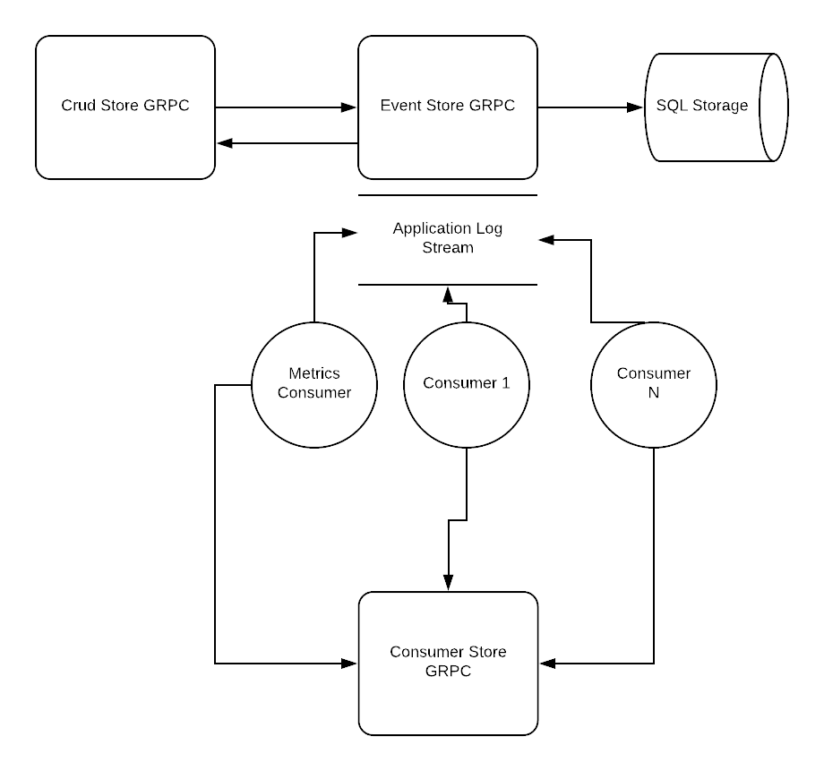

[](https://travis-ci.com/makkalot/eskit)

## ESKIT (Event Sourcing Kit)

Eskit is an Event Sourcing toolkit that can be used in two modes:
1. **As a Go library** - Embed event sourcing directly in your application (no gRPC/protobuf required)
2. **As microservices** - Run as distributed gRPC services

As Greg Young mentions in his talks, if you write an event sourcing framework you're probably doing something wrong.
ESKIT is not a framework - it's a collection of libraries and optional microservices with gRPC contracts.

### Version 2.0 - Library-First Architecture

v2.0 introduces a major refactoring where the core library (`lib/`) is now **completely independent** of gRPC/protobuf.
This means you can use ESKIT as a pure Go library without any code generation or network dependencies.

#### What is ESKIT:

- Event Sourcing Service (Append, Get operations) with Application Log (from Vaughn Vernon's book)
- CRUD Service : Uses ES service with predefined event types and does the replay for the user.
- Consumer Service to track the progress of Application Log
- Go and Python consumers to process the events from ES and Application Log
- It's an easy way to have CQRS with consumers and event logs easily.
- Makefile with lots of cool automations.
- Supports both GRPC and REST (grpc-gw). 


#### What ESKIT is not

- It's not an Event Sourcing Framework
- It's not production ready
- It's not fast as Kafka.


## Usage Modes

### Mode 1: As a Go Library (Recommended for most use cases)

Use ESKIT as an embedded library in your Go application. **No protobuf compilation or gRPC required.**

```go
package main

import (
    "context"
    "time"

    "github.com/makkalot/eskit/lib/eventstore"
    "github.com/makkalot/eskit/lib/crudstore"
    "github.com/makkalot/eskit/lib/types"
)

func main() {
    // Create an in-memory event store (or use SQL store with PostgreSQL)
    store := eventstore.NewInMemoryStore()

    // Create events with native Go types
    event := &types.Event{
        Originator: &types.Originator{
            ID:      "user-123",
            Version: "1",
        },
        EventType:  "User.Created",
        Payload:    `{"email":"user@example.com"}`,
        OccurredOn: time.Now().UTC(),
    }

    // Append event to store
    store.Append(event)

    // Or use CRUD store for automatic event replay
    ctx := context.Background()
    crudClient, _ := crudstore.NewClient(ctx, "postgres://...")

    // Define your entity type
    type User struct {
        Originator *types.Originator
        Email      string
        FirstName  string
    }

    user := &User{
        Email:     "user@example.com",
        FirstName: "John",
    }

    // CRUD operations automatically create events
    originator, _ := crudClient.Create(user)
}
```

**Benefits:**
- ✅ No protobuf code generation needed
- ✅ Pure Go types (no proto dependencies)
- ✅ Easy to test and embed
- ✅ Works offline (no network required)

### Mode 2: As Microservices

Run ESKIT components as separate gRPC microservices for distributed systems.

**Requirements:**
- Protobuf compiler (`protoc`)
- gRPC Go plugins

**Generate gRPC code:**
```bash
make generate-grpc
```

**Run services:**
```bash
# Via Docker Compose
make deploy

# Or via Kubernetes
make deploy-minikube
```

**Benefits:**
- ✅ Language-agnostic (gRPC clients in any language)
- ✅ Service isolation and scalability
- ✅ REST API via grpc-gateway

**Note:** If using microservices, your client code will work with protobuf types and require code generation.

## Migration from v1.x to v2.0

See [MIGRATION.md](MIGRATION.md) for detailed migration guide.

**Key breaking changes:**
- Library now uses `lib/types` instead of `generated/grpc/go/*`
- Field names follow Go conventions: `.Id` → `.ID`
- Timestamp fields use `time.Time` instead of Unix `int64`

### Architecture Overview

The kit itself consists of 3 microservices and 1 consumer

- Event Store
- Crud Store
- Consumer Store
- Metrics Consumer

## Event Store Service

Event Store Service is an append only service where users can append predefined event data. It supports the usual
2 operations `Append` and `Get`. It also adds a new concept called Application Log which is like an event stream (Kafka).
Every time a new `Append` request is sent the event is written to event store and application log at the same time in the 
same transaction. This is a trade off the service accepts in order to keep things simple instead of trying to implement
distributed transactions and etc. Consumers can poll/stream (`LogsPoll`) on that Application Log and process all the events flowing through
the system. The consumers are responsible for storing the offset of their their progress. ESKIT has a reference implementation of 
consumer client where it sores its progress on `Consumer Store`.


## Crud Store Service

Crud Store service is built on top of Event Store Service and uses it as data storage. It supports 4 basic CRUD operations
and some listing capabilities. In general when implement Event Sourcing systems you have to have handlers that replay the events and create the 
current state of the entities. What Crud Store does is, it has 3 (`Created`, `Updated`, `Deleted`) predefined event types and tries to do the replay for the user.
On client facing side the user only sees real objects and no events, it's like a NoSQL database with history. When an update operation is
sent only diff of previous state and new state is saved to the event store Event Store. Under the hood Crud Store uses `JSON Merge Patches` to replay the objects from 
the diffs. Using Crud Store is totally optional, user can just use Event Store and do the replay by herself. 
Currently Crud Store doesn't support Snapshotting, something to be added in the future.

Crud Store works with Json Payloads for CRUD operations. ESKIT also includes a Go client which works at Protobuf (Golang struct)
level and does all the JSON conversion for the user.


## Consumer Store Service

Consumer Store Service is simple service that helps consumers keep the progress when they read the Application Log.
Its useful if consumer is crashed so can continue from where it left off.


## Metrics Consumer

Metrics Consumer is an example implementation of how to write consumers to process the Application Log.
Currently it reads all of the events flowing and saves the metrics to Prometheus. Project all has grafana dashboards
which can display some interesting facts about the events flowing in the systems.

General Microservice Architecture looks like :




 
## To Run It Locally:

##### Requirements :
- docker (with compose plugin)

##### Run Tests Locally (in docker compose):
- `make test`

##### Deploy to Docker Compose Locally  :
- `make deploy`

##### Deploy to Minikube Locally (requires already running cluster):
- `make deploy-minikube`

##### Deploy to DO (requires already running cluster):
- `make deploy-do`


### How to contribute ?

- Create a fork
- Clone your own fork : `git clone git@gitlab.com:<you-user-name>/eskit.git`
- cd `eskit`
- Add upstream : `git remote add upstream git@github.com/makkalot/eskit.git`
- Fetch The latest changes from the upstream : `git fetch upstream`
- Merge them to your master : `git rebase upstream/master`
- Create the branch you want to work on : `git checkout -b <branch-name>`
- When ready with your changes push them to your branch : `git push origin -u <branch-name>`
- Before open a Merge Request : rebase against the upstream master branch (if someone did some change)
    - `git checkout master`
    - `git fetch upstream`
    - `git rebase upstream/master`
    - `git checkout <branch-name>`
    - `git rebase -i master`
- Push latest changes to your branch (after the rebase):
    - `git push origin -f <branch-name>` (Note that we apply -f because of the rebase in prev step, careful !)
- Create a MR.

For more information about rebasing :
    - https://www.atlassian.com/git/tutorials/rewriting-history
    - https://www.atlassian.com/git/tutorials/merging-vs-rebasing

Maintainer :
- Denis Kyorov   : makkalot at gmail dot com

Contributors:

- Korhan Yazgan  : korhanyazgan at gmail dot com

